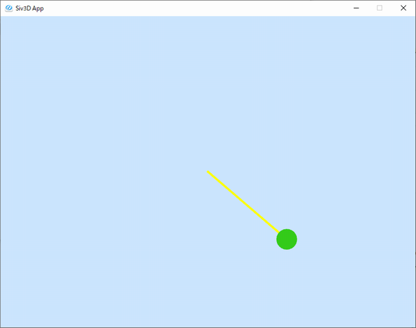

# 振り子の動きシミュレーション

単振り子の動きのシミュレーションを、次の式を順次計算することで行います。

  


※ 座標系は左上原点としています。



## Huriko1 : オイラー法

Huriko1では、オイラー法による計算を行っています。  
この実装では  が十分に小さくないため、計算誤差が累積されて振れ幅が大きくなるのが分かりやすいです。  
また、オイラー法は精度が低めであることも寄与しています。

```cpp
# include <Siv3D.hpp> // OpenSiv3D v0.6.3

void Main()
{
	// ウィンドウ設定
	Scene::SetBackground(ColorF(0.8, 0.9, 1.0));

	// 定数
	constexpr double g = 9.8;
	constexpr double L = 2.0;

	// 初期値
	double theta = 40.0_deg + 180_deg;
	double omega = 0.0;


	double dt;

	while (System::Update())
	{
		dt = Scene::DeltaTime();

		// オイラー法で現在の角度thetaと角速度omegaを計算
		double theta1 = theta + omega * dt;
		double omega1 = omega + g * std::sin(theta) / L * dt;

		theta = theta1;
		omega = omega1;


		// 描画
		const Vec2 pos = OffsetCircular(Scene::Center(), 200, theta);
		Line(Scene::Center(), pos).draw(4, Palette::Yellow);
		Circle(pos, 20).draw(ColorF(0.2, 0.8, 0.1));
	}
}
```


## 利用方法

想定環境

- Windows
- Visual Studio 2022

必要ライブラリ

- OpenSiv3D v0.6.3 [https://github.com/Siv3D/OpenSiv3D](https://github.com/Siv3D/OpenSiv3D)
   

OpenSiv3D SDKをインストール後に、Visual Studio 2022で新規のOpenSiv3Dプロジェクトを作成します。  
その後、作成されたプロジェクト内のMain.cppを、このリポジトリ内のMain.cppに置き換えてください。


参考:  
http://www.isc.meiji.ac.jp/~re00108/ch10/
